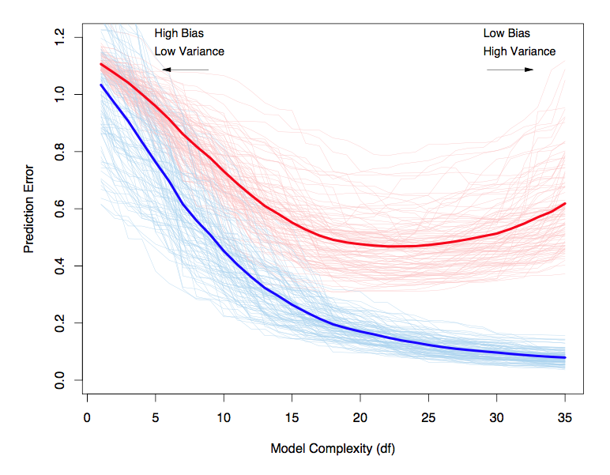
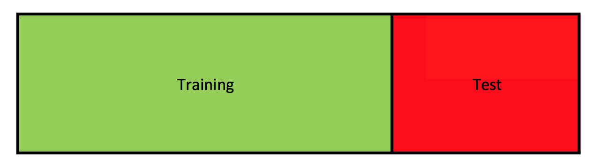
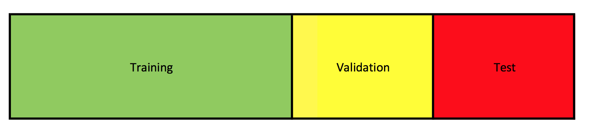
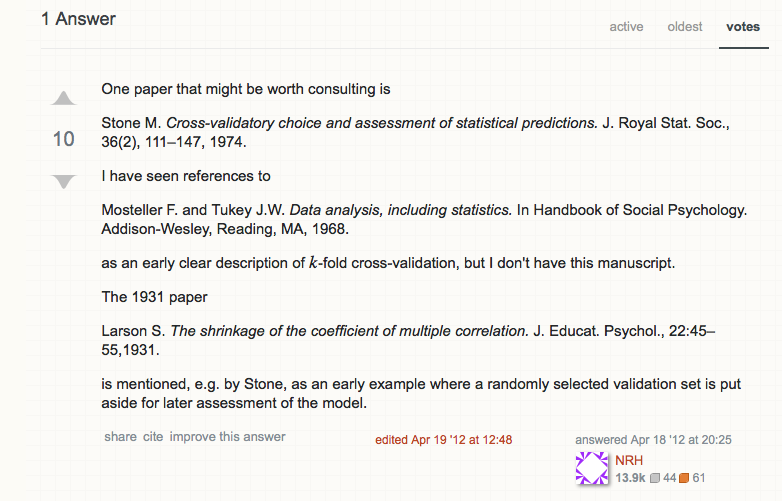

```{r label = setup, echo = FALSE, message = FALSE, warning = FALSE}
knitr::opts_chunk$set(
  dev.args = list(bg = 'transparent'),
  fig.align = "center",
  cache = FALSE
)
set.seed(171123)
library("tidyverse")
```


# Today

A short plenary lecture 60 minutes? 

Rest of the time: (Previous) Exercises!


## Topics

* Bias-Variance trade-off (Remember $MSE$)    

* Prediction Error   

* Cross-validation    


**Literature:** Chapter 2 (2.1 - 2.3) and Chapter 7 (7.1 - 7.4, 7.10-7.12) from the book by Hastie, Tibshirani, and Friedman (2009). 


## Learning objectives

Having studied this week's course material you should be able to:

* Use the concept of prediction error to choose models for prediction purposes.   

* Implement a cross-validation procedure to estimate prediction error


# Introduction | the context


## Estimators

For the purpose of prediction, often you prefer

\`a worse and biased estimator $T$ for $\theta$ of the true model $P_{\theta}$ that underlies your data $Y$ (and or given $\mathbf{X}$).'

over

\`the best and unbiased estimator $T$ for $\theta$'

**NB: prediciting a phenomenon can be very different from explaining a phenomenon!**


## Unbiased models: examples

We (may) have learned...    

**Linear regression:**    

if $y_i \sim N(\bf{x_i}\beta, \sigma_{\epsilon}^2)$, the best prediction is given by $\widehat{y_i} = \bf{x_i}\beta$.

**Logistic regression (with probit link):**    

if $y_i \sim Bernoulli(\Phi(\bf{x_i}\beta))$ then you could define the best prediction as the rounded values of $\Phi(\bf{x_i}\beta)$.


## Unbiased estimators: examples

To find an optimal value for ${\beta}$ in a linear regression model we maximize the likelihood $\mathcal{L}(\beta, \bf{X}, \bf{y})$ using:

$$\widehat{\beta} = (\bf{X}'\bf{X})^{-1}\bf{X}'\bf{y}.$$

This estimator is BLUE (Best Linear Unbiased Estimator).

Unbiased: $\textrm{E}[\widehat{\beta}] - \theta = 0$    

Best: $\widehat{\beta} = \text{argmax}_T \mathcal{L}(\beta, \bf{X}, \bf{y})$   


## A Fitted Model and its Predictive Power

Once we observe data $\bf{X}$ the fitted model is (likely) wrong ('biased') 

* Statistically because of random error

* (numerically because we can only represent a finite number in a computer)

Unbiased estimation is a desireable property but not a guarantee for higher (average) predictive performance


## Bias-variance trade-off

$$MSE(T) = \textrm{E}[(T - \theta)^2] = \left(\textrm{E}[T] - \theta\right)^2 + \textrm{E}[\left(T - \textrm{E}[T]\right)^2]$$

```{r, echo = FALSE, fig.width = 5, fig.height = 5}
set.seed(123)
N <- 15
x1 <- rnorm(N)
y1 <- rnorm(N)

x2 <- rnorm(N, 0.25, 0.25)
y2 <- rnorm(N, 0.25, 0.25)

degrees <- seq(0, 2*pi, by=0.01)
radius <- 1
cy <- sin(degrees)
cx <- cos(degrees)

plot(0, 0, pch=16, xlim=c(-2, 2), ylim=c(-2, 2), asp=1, xlab="", ylab="", xaxt='n', yaxt='n')
lines(cy, cx)
lines(cy*0.5, cx*0.5)
lines(cy*1.5, cx*1.5)
lines(cy*2, cx*2)
points(x1, y1, pch=15, col='red')
points(x2, y2, pch=17, col='blue')
```

## Measures of performance

For the example of a linear regression model:

* $R^2$ / $R^2_{adj}$
* AIC / BIC 
* Prediction error

$R^2$ and prediction error will (generally) not be equal because they represent fundamentally different quantities.


## Measures of performance



# Different types of error

1. Training Error    
2. Test Error    
3. Expected Prediction Error (EPE)

## Training error

$\overline{\textrm{err}} = \frac{1}{N}\sum_{i=1}^{N}L(y_i, \widehat{f}(\mathbf{x}_i))$

* $N$ is the sample size
* $y_i$ is some observed outcome in the training data we want to predict
* $\mathbf{x}_i$ is some training data vector of observed values used to predict $y_i$
* $\widehat{f}$ is an optimized function to predict $y_i$ on the basis of $\mathbf{x}_i$.
* $L$ is a loss function that measures the error in our prediction, e.g. $1 - R^2$.


## Quiz: Training Error


## Test Error (is conditional on $\mathcal{T}$)

$\textrm{Err}_\mathcal{T} = E_{Y^b, \mathbf{X}^b}[L(Y^b, \widehat{f}_\mathcal{T}(\mathbf{X}^b))| \mathcal{T}]$

- The expected error of a (fitted) model $\widehat{f}$ on **new** data $Y^b$ and $\mathbf{X}^b$ (drawn from the same sample distribution). Here, $\widehat{f}$ is the optimized model for **one** training data set ${\mathcal{T} = \{Y, \mathbf{X}}}$.    

- The error we expect to see if we use $\mathcal{T}$ to fit our model, but then predict the outcomes for new data    

- Will be low for models that 'correctly learn' from the data   

## Quiz: Test Error


## Expected Prediction Error (EPE)

$\textrm{EPE} = \textrm{Err} = \textrm{E}_\mathcal{T} [\textrm{Err}_\mathcal{T}]$

The error we expect to see if we use $\mathcal{T}$ to fit our model and then predict the outcomes of new data, 'averaged' over all possible training data sets for $\mathcal{T}$.

Will be low if your model resembles the true model

Tells you how well your model predicts (on average)

Does **not** tell you the 'correctness' of your model


## Quiz: EPE


## Prediction error: example 1

(simple) linear regression:

$L(\bf{y} , \bf{X} )$ $= \sum_i^{N}(y_i - \widehat{f}({x}_i))^2$

and

$\widehat{f}(x_i) = \widehat{\beta}_0 + \widehat{\beta}_1{x}_{i1}$


## Prediction error: example 2

Classification (e.g. two classes problem):

$L(\bf{y} , \bf{X} )$ $= \sum_i^{N}I(y_i \neq \widehat{f}(\bf{x}_i))$

and

$\widehat{f}(\bf{x}_i)$ $= I\left(\frac{exp(\bf{x}_i\beta)}{1+exp(\bf{x}_i\beta)}  > 0.5 \right)$


# Assessing Test Error| Use data for one purpose only...


## Split the data into two

To assess the prediction (test) error you can split the data into:



* Use training to fit your model
* Use test to assess the test error of your model

## Split the data into three

If you want to choose between different models you can split the data into:



* Use training to fit your models
* Use validation to choose between models
* Use test to assess the test error of the chosen model


## Drawbacks

You are not using all your data to make a model 

Model trained on all the data will be better and thus predict better (in general)

More efficient use of your data: cross-validation

# Cross-validation

## Cross-validation

Is a tool that can be theoretically embedded based on properties of model selection criterion (e.g. has similarity with AIC/BIC).

A tool to estimate the expected prediction error of a model

Can be used to choose between models

Two main variations:

* leave-$p$-out cross-validation
* $K$-fold cross-validation

## Leave $p$-out cross-validation

1. Determine all $\binom{N}{p}$ combinations of objects split over training and validation sets

2. For each combination in $\binom{N}{p}$
    - build/fit a model based on all samples in the training set
    - use the fitted model to predict the outcomes of the samples in the test set

Usually unfeasible due to the sheer number of possibilities: e.g. with $N=100$, and $p$=10, number of combinations is: `choose(100, 10)` > 10000000000000

Example exception (and often used version) is leave-one-out cross-validation (requires 'only' $N$ computations)

## $K$-fold cross-validation

Provides a reasonable approximation to leave $p$-out cross-validation (works like an MC study)

Often presented as a method all on its own

1. Divide the samples into $K$ cross-validation folds (groups) at random

2. For each fold $k = 1, 2, ... K$
    - build/fit a model based on all samples *not* in set $k$
    - use the fitted model to predict the outcomes of the samples in set $k$


## MSE of the expected prediction error (EPE)

Trade-off between fewer and larger number of folds 

* Less folds: higher bias, lower variance
* More folds: lower bias, higher variance

Thus:

* EPE of $K$-fold cross-validation has higher bias than leave-$1$-out (overstimates EPE because training sets are smaller)

* EPE of leave-$1$-out cross-validation has higher variance because the training sets are more alike (resemble more closely the original data set)


## Interlude: MSE and variance

```{r, echo=FALSE, fig.width=5, fig.height=5}
set.seed(123)
N <- 15
x1 <- rnorm(N)
y1 <- rnorm(N)

x2 <- rnorm(N, 0.25, 0.25)
y2 <- rnorm(N, 0.25, 0.25)

degrees <- seq(0, 2*pi, by=0.01)
radius <- 1
cy <- sin(degrees)
cx <- cos(degrees)

plot(0, 0, pch=16, xlim=c(-2, 2), ylim=c(-2, 2), asp=1, xlab="", ylab="", xaxt='n', yaxt='n')
lines(cy, cx)
lines(cy*0.5, cx*0.5)
lines(cy*1.5, cx*1.5)
lines(cy*2, cx*2)
points(x1, y1, pch=15, col='red')
points(x2, y2, pch=17, col='purple')
```

## Cross-validation: beware

"In general, with a multistep modeling procedure, cross-validation must be applied to the entire sequence of modeling steps. In particular, samples must be “left out” before any selection or filtering steps are applied. There is one qualification: initial unsupervised screening steps can be done before samples are left out."

For example, selecting the 10 variables with the highest variance is ok; selecting the 10 best univariate predictors is not ok.

## Cross-validation: the wrong way

Goal: we wish to estimate the prediction error of a linear regression model in which we select only 10 of 100 variables to be active in our analysis

1. Perform a linear regression analysis
2. Find the 10 most promising variables based on biggest univariate correlation between predictors and dependent variable
3. Use $K$-fold cross-validation to estimate the prediction error of a model using these 10 variables

We estimated the prediction error of the variables that we selected, not of the 'procedure': do a linear regression model where only the best 10 are selected

## Cross-validation: the right way

Goal: we wish to estimate the prediction error of a linear regression model in which we select only 10 of 100 variables to be active in our analysis

1. Divide the data into $K$ sets, then for $k$ in $1, 2, ... K$:
    a. check which 10 variables are most promising based on all objects *not* in sample $k$
    b. make a model based on these 10 variables
    c. predict the outcomes of the objects in sample $k$
2. Sum the error accumulated over the $K$ folds

Gives the estimated prediction error of the procedure in which we select 10 promising variables

Possible uses: compare this EPE with one for this procedure picking instead only 9 variables.

<!---
A sort of rule of thumb you can use is: if what you do could be applied in a situation where you first split the data (into a training and test set) then do training and validation seperately on those sets, you're probably using cross-validation correctly.
--->

## Cross-validation: programming

In the exercises!

Pseudo-code algorithm in earlier slide is really all you need.

For more on cross-validation, details and extensions, see e.g. The Elements of Statistical Learning by Hastie, Tibshirani & Friedman (2009) and "An Introduction to Statistical Learning" by James et al. (2017?). Both freely available on the internet.

## Cross-validation: Who Gets the Credits?

[And the credits go to.....](https://stats.stackexchange.com/questions/26696/who-invented-k-fold-cross-validation
)




## Next week

Dynamic Documents: Reproducible Reports

Homework: 

- See whether you can build (= 'knit') the .html files and .pdf files of the course material from the R Markdown (`.Rmd`) source files. If you don't manage, e-mail your errors --> rteam\@statscience.nl.    

## Assignment FAQ

Assignment Deadline: 08 January 2019, 13.00 hour       

The assignment will be online on Monday December 10 the latest!

# Exercises
