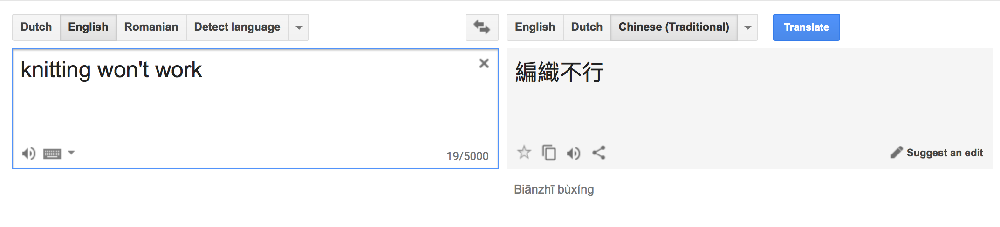

```{r setup, include=FALSE}
knitr::opts_chunk$set(echo = TRUE,
  dev.args = list(bg = 'transparent'),
  fig.align = "center"
)
library("tidyverse")
```


## 1. Create your Rproject of this week's course material

Open from this week's course material the `.RProject` file, and check out the differences between the Project Options and the Global Options.  


## 2. From .Rmd to .pdf and to .html

If you haven't done so yet, try to `knit` the default R Markdown file

You can obtain the default R Markdown file in RStudio by

`File --> New File --> R Markdown.`


## 3. Tutorial R Markdown

Try to see whether you can get quickly through the tutorial on: http://rmarkdown.rstudio.com/lesson-1.html


## 4. Your own Rproject

Reproduce the `.pdf` files and the lecture IO-slides presentation from the R Markdown source files of this week's lecture material.


## 5. Things that affect the knitting of your R Markdown file (and perhaps your final grade)

The more more dynamic your document, the more easily it becomes buggy for someone to reproduce your code. In this exercise we discuss some of the common errors that occur while sharing .Rmd files.


### a Pandoc Error 49

#### i `keep_tex` or `keep_md`

Include either one of the following `keep_tex` or `keep_md` parameters in the `YAML` header of your R Markdown file. What extra files are made in the directory of your `Rproject`?

```
---
output: 
  pdf_document: 
    keep_tex: yes
---
```

or

```
---
output:
  html_document:
    keep_md: yes
---
```

**Answer**

We get either an extra `.tex` file or the extra `md` file. Depending on the R Markdown file we are trying to `knit`.


#### ii Strange symbols

Are you able to `knit` Chinese characters as text in an `RMarkdown` file? Try it out! When you receive an error, it may refer to a line number. When you've put the Chinese characters in your text, you should be able to find this line number in the `.md` or `.tex` file.

<!-- 編織不行 -->


**Answer**

Most [character codes](http://ergoemacs.org/emacs/unicode_basics.html) can be knitted from R Markdown to .html, and almost all can be knitted to .pdf using the default settings. Other special characters (like the Chinese character symbols) cannot be `knitted` to `.pdf` or \LaTeX using the default settings.

Note that an `.Rmd` file with chinese characterscan `knit` to a `.tex` file as output, but cannot `knit` to the final output form:  e.g. `.pdf`. 
Conslusion: be aware of special character symbols in your text in the `RMarkdown` file. 


### b Some not-so-smart-to-do things: Do try them at home!

#### i

Why should you NOT have an R chunk in your R Markdown file that will evaluate the code `rs.restartR()`? 

**Answer**

You won't be able to knit your markdown file anymore, and therefore cannot create the dynamic document / reproducible report....

Try it out yourself by putting the `eval` argument to TRUE: 

```{r, eval = FALSE}
.rs.restartR()
```

#### ii 

Will `View(mtcars)` get evaluated when knitting an R Markdown file?

**Answer**

Yes, don't do it... it's annoying and useless. `View()` is a function you would like to use while coding. If you have a good reason to make `View()` appear in a code chunk, then, at least set the R Chunk argument `eval` equal to FALSE.

```{r, eval = FALSE}
View(mtcars)
```


### c Standalone

Should we always start an R Markdown file with `rm(list = ls())` such that objects that are left in your workspace cannot negatively affect the `R` code chunks? Or is an R Markdown file `standalone`? 

If you don't know the answer to this question, try to experiment and see whether your R Markdown file can make use of the variables in your global space (these are the variables that show when you type `ls()` in your `R` console).

**Answer**

The R Markdown file is `standalone`.


### d Rick Roll: Know your meme

How can you `Rick Roll` someone within R Markdown? You need to be able to open an internet browser.. and use e.g. a youtube url to Rick Astley's video clip.

Rickrolling: https://en.wikipedia.org/wiki/Rickrolling


**Answer**

Like this:

```{r}
browseURL("https://www.youtube.com/watch?v=dQw4w9WgXcQ")
```

Since the existence of the Statistical Science programm (that started in 2009), the course instructors of "Statistical Computing with `R`" have been Rick-Rolled. This was in the year 2015-2016. Although the specific student who Rick-Rolled the instructor obtained a bonuspoint for originality, this year it may affect your grade in a negative way...


## 6 Use `rmarkdown::render` from the R console

By using the function `rmarkdown::render()` from your `R` console, see whether you can reproduce the `.pdf` files and the lecture IO-slides presentation from the R Markdown source files of this week's lecture material. 


**Answer**

Keep this R chunk on `eval = FALSE`!

```{r, eval = FALSE}
# knitting the exercises
rmarkdown::render(input = "w11_Reproducible_Reports_slides.Rmd", "all")
rmarkdown::render(input = "w11_Reproducible_Reports_exercises.Rmd", "all")
```


## 7 Optional: Play with Pandoc from your terminal

By using pandoc in your terminal, see whether you can reproduce the exercises from the **Markdown** source files of this week's lecture material. Note, that we are specifically talking about the markdown files and not the R Markdown files..

*Hint: use the terminal commands that show in the "RMarkdown console" when you render your `Rmd` file in the usual way (via the button 'knit' or `rmarkdown::render()`)*

**Answer**

First run in R 

```{r, eval = FALSE}
rmarkdown::render(input = "w12_Reproducible_Reports_exercises.Rmd", output_format = "md_document")
```

Then use pandoc in your unix shell (Note this is done from OS X) for the exercises run something like:

```{bash, eval = FALSE}
/Applications/RStudio.app/Contents/MacOS/pandoc/pandoc +RTS -K512m -RTS w11_Reproducible_Reports_exercises.md --to latex --from markdown+autolink_bare_uris+ascii_identifiers+tex_math_single_backslash --output w11_Reproducible_Reports_exercises.pdf --template /Library/Frameworks/R.framework/Versions/3.4/Resources/library/rmarkdown/rmd/latex/default-1.17.0.2.tex --highlight-style tango --latex-engine /Library/TeX/texbin/pdflatex --variable graphics=yes --variable 'geometry:margin=1in'
```


## 8 Optional: R Markdown Gallery

Check out the (gallery)[http://rmarkdown.rstudio.com/gallery.html] and challenge yourself to reproduce at least one of them on your own computer.


## 9 Practicing R again: Yahtzee and Maximum-Likelihood estimation

The following poker-themed combinations of five dice appear in the game of yahtzee:

- *Yahtzee* (five of a kind; e.g., 5 ones, 5 twos, or 5 threes)   

- *Carre* (four of a kind)    

- *Three of a kind*   

- *Full house* (three and two of a kind)   

- *Large Straight* (five sequantial dice)

- *Small straight* (four sequential dice)

For the next exercises try to write your answers conform a consistent style of coding in R. Also, try to see where the `%>%` can be implemented, or not.


### a 

All possible rolls with five dice are collected in all.rolls. Note that `12222`
appears five times because there are five ways to roll `12222` (`12222`, `21222`, `22122`, `22212`, and `22221`). 

The following code is constructing all.rolls: 

```{r}
all.rolls <- apply(t(apply(as.matrix(expand.grid(1:6,1:6,1:6,1:6,1:6)
),1,sort)),1,paste,collapse="")
```

Rewrite this code in something more readable. 

*Hint: you may use the `%>%` operator.*

**Answer**

```{r}
all.rolls <- expand.grid(rep(list(1:6), 5)) %>%
  as.matrix() %>%
  apply(1, sort) %>%
  t() %>%
  apply(1, paste, collapse = "")    
```

### b

What is the probability of rolling `11344`? Note that the order doesn't matter here.

**Answer**

```{r}
length(all.rolls[all.rolls == "11344"]) / length(all.rolls)
# The order does not matter because all.rolls is sorted already...  check:
length(all.rolls[all.rolls == "34411"]) / length(all.rolls)
length(all.rolls[all.rolls == "43411"]) / length(all.rolls)
```


### c

The next code will be used to investigate which rolls are yahtzee, carre, three of a kind, full house, large straight, and small straight. Could you make the code for the `full.set` by using the variables in the the following code?


```{r}
N <- all.rolls %>% length()

#yahtzee
five.set <- c("11111","22222","33333","44444","55555","66666")
is.five <- substr(all.rolls, 1, 5) %in% five.set

# carre

four.set <- c("1111", "2222", "3333", "4444", "5555", "6666")
is.four <- rep(FALSE, N)
is.four <- substr(all.rolls, 1, 4) %in% four.set | is.four
is.four <- substr(all.rolls, 2, 5) %in% four.set | is.four

# three of a kind
three.set <- c("111", "222", "333", "444", "555", "666")
is.three <- rep(FALSE, N)
is.three <- substr(all.rolls, 1, 3) %in% three.set | is.three
is.three <- substr(all.rolls, 2, 4) %in% three.set | is.three
is.three <- substr(all.rolls, 3, 5) %in% three.set | is.three

# full house
two.set <- c("11", "22", "33", "44", "55", "66")
# full.set <- _ _ _ 
# is.full <- substr(all.rolls, 1, 5) %in% full.set

# large straight
large.set <- c("12345", "23456")
is.large <- substr(all.rolls, 1, 5) %in% large.set

# small straight
small.set <- c("1234", "2345", "3456")
is.small <- rep(FALSE, N)
is.small <- substr(all.rolls, 1, 4) %in% small.set | is.small
is.small <- substr(all.rolls, 2, 5) %in% small.set | is.small
```


**Answer**

With the pipe operator it would be a bit of a hassle. Without, we think that just reformatting the code would be more readable when done as follows:

```{r}
full.set <- unique(
  c(outer(two.set, three.set, paste, sep = ""),
    outer(three.set, two.set, paste, sep = "")
  )
)
is.full <- substr(all.rolls, 1, 5) %in% full.set
```


### d

Create a `data.frame` containing `all.rolls`, `is.five`, `is.four`, `is.three`,`is.full`, `is.large`, and `is.small`.


**Answer.**
```{r}
X <- data.frame(all.rolls, is.five, is.four, is.three, is.full, is.large, is.small)
```

### e

Compute the probability that a single roll results in a particular poker-themed combination, for each of the combinations.

**Answer.**

```{r}
N <- nrow(X)
P.five <- sum(is.five)/N
P.four <- sum(is.four)/N
P.three <- sum(is.three)/N
P.full <- sum(is.full)/N
P.large <- sum(is.large)/N
P.small <- sum(is.small)/N
c(yahtzee = P.five, carre = P.four, three = P.three, 
  fullhouse = P.full, large = P.large, smal = P.small
)
```


### f

Write code to repeatedly roll five dice until a roll yields a full house. How many
rolls were necessary?

Make sure to set a seed (`set.seed()`) s.t. others can obtain the exact same results.

**Answer** 

```{r}
set.seed(171102)
counter <- 0
repeat {
  counter <- counter + 1
  roll <- sample(1:N,1)
  if (X[roll,"is.full"]) break
  next
}
counter
```


### g
Use a for-loop to execute the code from item f for `B <- 1000` times. Save the number of rolls needed to get a full house in a vector.

Make sure to set a seed (`set.seed`) s.t. others can obtain the exact same results.

**Answer**

```{r}
set.seed(171102)
B <- 1e3
n.rolls <- numeric(B)
for (i in 1:B) {
  n.rolls[i] <- 0
  repeat {
    n.rolls[i] <- n.rolls[i] + 1
    roll <- sample(1:N,1)
    if (X[roll,"is.full"]) break
    next
  }
}
summary(n.rolls)
```

### h

The counts we have obtained in item g  were the results from sampling processes from a negative binomial distribution function. The number of rolls can be seen as the number of trials until (and including) the occurence of a succes. Plot the negative binomial cumulative distribution function (cd) of the results (each of the B counts). You may use `pnbinom`, or you can program the cdf yourself.


**Answer**

```{r}
plot(y = pnbinom(q = n.rolls, size = 1, prob = P.full, lower.tail = TRUE),
     x = n.rolls,
     ylab = "Cumulative Prob",
     xlab = "N trials"
)
```

### i

Plot the log-likelihood *all* the numbers of rolls together (item c). The vertical axis should represent the log-likelihood, and the horizontal axis the probability. Make two plots. The first plot shows the log-likelihood for a probability in the interval (0 - 1), the second plot shows the log-likelihood for the probability in the interval (0 - 0.2). Last, what is the maximum likelihood estimator?

*Hint: make sure that the vertical axis of the second plot is scaled nicely s.t. the shape is clearly a parabola*

**Answer**


```{r, eval = TRUE}
NBLL <- function(q, size, prob) {
  # Negatie Binomial Log-Likelihood function for all rolls
  sum(dnbinom(x = q, size = size, prob = prob, log = TRUE))
}
probs <- seq(0,1,length.out = 1002)[-c(1,1002)] # probability vector

# The values of the log-likelihood for each probability:
nblls <- lapply(probs, function(p){
  NBLL(q = n.rolls, size = 1, prob = p)
})
```

The code for the plots:

```{r label = plot_nbll, eval = FALSE}
par(mfrow = c(1,2))
plot(y = nblls, x = probs, type = "l", 
    main = "Full picture", 
    xlab = "probability", 
    ylab = "log-likelihood")
plot(y = nblls[1:200], x = probs[1:200], type = "l", 
    main = "Zoomed in....", 
    xlab = "probability", 
    ylab = "log-likelihood")
par(mfrow = c(1,1))
```

The plots:

```{r ref.label="plot_nbll", echo = FALSE}
```

The value of the maximum likelihood estimate is `r probs[which.max(unlist(nblls))]`, whereas the true probability is `r P.full`.


## 9 Optional: Yahtzee roll function

Programm your own [Google's R Style](https://google.github.io/styleguide/Rguide.xml) `YahtzeeRoll` function. 

The function does need to have any input arguments, it returns a list of two items. From the first item of the list we can retrieve the values of your roll of six dices and in the second item of the list it is explained whether and which of poker-themed combinations you may have obtained.

**Answer**

```{r}
YahtzeeRoll <- function() {
  # Show your results for one roll of the dices in Yahtzee
  
  # Returns:
  #   A list of 2 items: the first item shows the values of the dices you obtained from your rill, the second item tells you whether it's a poker-themes combination.
  
  
  myroll <- sample(1:6, replace = TRUE)
  
  theme.message <- c(
    "Yahtzee",
    "Carre",
    "Three of a kind",
    "Full house",
    "Large straight",
    "Small straight"
  )
  
  # yathzee sets
  theme.sets <- list(
    five.set = c("11111","22222","33333","44444","55555","66666"),
    four.set = c("1111", "2222", "3333", "4444", "5555", "6666"),
    three.set = c("111", "222", "333", "444", "555", "666"),
    two.set = c("11", "22", "33", "44", "55", "66"),
    full.set = unique(
      c(outer(two.set, three.set, paste, sep = ""), 
        outer(three.set, two.set, paste, sep = "")
      )
    ), 
    large.set = c("12345", "23456"),
    small.set = c("1234", "2345", "3456")# small straight
  )
  
  # Check whether my roll is a theme:
  success.any <- lapply(theme.sets, function(themeroll) {
    success <- any(paste0(myroll, collapse = "") %in% themeroll)
    return(success)
  })
  success.any <- success.any %>% unlist()

  # Create a message
  mymessage <- if(TRUE %in% success.any) {
    yahtzee.theme <- theme.message[success.any]
    paste0("Yeah, you've got a ", yahtzee.theme, "!")
  } else {
    paste0("Better luck next time ")
  }
  
  # Output our results
  out <- list(roll = myroll, message = mymessage)
  return(out)
  
}
```


## 10 Optional: A last fair dice problem

Make a while-loop in which you roll three dice until they are all equal `(111,
222,...666)`. How many rolls do you need?

Make sure to set a seed (`set.seed`) s.t. others can obtain the exact same results.

**Answer**

```{r}
set.seed(171102)
count <- 1
dices_3 <- 1:3
while (dices_3[1] != dices_3[2] | dices_3[2] != dices_3[3]) {
 dices_3 <- sample(1:6, 3, replace = T)
 count <- count + 1
}
count
```


