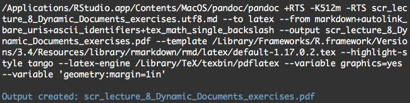

```{r label = setup, echo = FALSE, message = FALSE, warning = FALSE}
knitr::opts_chunk$set(
  dev.args = list(bg = 'transparent'),
  fig.align = "center",
  cache = FALSE
)
set.seed(171123)
library("tidyverse")
```


# R Project Management

By courtesy of [Edwin Thoen](https://rviews.rstudio.com/2017/09/05/writing-and-publishing-my-first-r-package/), [Chester Isamy and Albert Y. Kim](https://ismayc.github.io/rbasics-book/), and [Rstudio Webinars](https://www.rstudio.com/resources/webinars/)    

## Lecture - Part 1 (14.15 - 15.00)

About Project Management

IDE Rstudio: `Rproj` and its `.hiddenfiles`

Structuring your files.

Tidy programming: literate style, format


## Lecture - Part 2 (15.15 - 16.00)

Dynamic Documents: 

- R Markdown  
- knitr   
- Markdown   
- Pandoc   


## Part 1: learning objective(s)

Learn to facilitate the workflow of your projects by   

- using RStudio as your (IDE) 

- structuring your working directory

- naming files according to their 1 purpose   

- applying a consistent and readable coding style


## Project Management | Stress free projects... do not exist.

**Example:** Data comes from different sources (not in 1 file). The data needs cleaning, to be merged, summarized ..., ending in all kinds of different data versions.   

**Result:** Many scripts, hundreds of lines of code in each. 

**Need:** A structured way of working for a good workflow.


# Your IDE: RStudio

Some examples:

[RStudio Docs](https://support.rstudio.com/hc/en-us/categories/200035113-Documentation?version=0.99.491&mode=desktop)  
<!-- click to Basic usage of the RStudio IDE -->

[RStudio Support](https://support.rstudio.com/hc/en-us)   

[Cheatsheets](https://www.rstudio.com/resources/cheatsheets/)

"[Markdown Quick Reference](http://rmarkdown.rstudio.com/authoring_basics.html)" opens in Viewer.


## RStudio (Desktop IDE)

Integrated development environment for R, to bring your workflow together.

workflow: "the sequence of industrial, administrative, or other processes through which a piece of work passes from initiation to completion." *Oxford Dictionary*


## RStudio (Desktop IDE) 

[3.4. RStudio Basics](https://ismayc.github.io/rbasics-book/)

- Addins    

- Tools --> Global Options /  RStudio --> Preferences   


## Rproject
 
A useful aspect of RStudio is its project management functionality --> `Rproject`.

We will be using this today to create a self-contained, reproducible project:

- It creates a directory for all scripts and data.

- By default, your `Rproj` file is automatically in your working directory.


## Why (not) Rproject?

**Pro:**       

- https://www.r-bloggers.com/managing-projects-using-rstudio/
- You can keep your project related settings.
- It makes it easier to restart your project after a break.   

**Contra:**     

- If you don't like change.    
- Slightly less useful **without** using the functionalities of the `packrat` package... 
- Less useful **without** using any version control on your source files     ([git](https://git-scm.com) or [SVN](https://subversion.apache.org/))    
- It is quite annoying when you keep your projects on dropbox.   


p.s. [Want to learn Git?](https://www.deleidscheflesch.nl/p/gitworkshop)     


## `PROJECTNAME.Rproj` | for  projects

To create a new project in RStudio:

1. Click the "File" menu button, then "New Project".   
2. Click "New Directory" (or existing directory, or ...)   
3. Click "Empty Project".   
4. Type a descriptive directory name: This is the title of your project, e.g. "171102SCR_Dynamic_Documents".  
5. Store the new directory in a sensable place in your computer’s organizational scheme.   
6. Click "Create Project".


# RStudio and hidden files

## `.RData`, `.Rhistory`, and possibly `.Rprofile` 

Files starting with a dot are **hidden files**. By default, the hidden R files are loaded from the directory where R(Studio) is started.

Check 

- in *R*: `list.files(all.file = TRUE)`,     
- or search the WWW for "dot files"/"hidden files" to see how you can reveal them on your OS, or see them from another command line (e.g. bash).


## `.RData`, `Rhistory`, and `.Rprofile` 

`.RData`: the saved workspace in your directory.    
*example:* `save(list = ls(), file = ".RData")`        

`.RHistory`: commands history in your directory.         
*example:* `savehistory(file = ".Rhistory")`         

`.Rprofile`: customizations for the R startup `?Startup`.    
*example:* define custom functions (udfs) used project wide.    

If you are using (your own) functions over projects consider writing your [own package](http://r-pkgs.had.co.nz/).


## One Task, One Script

Logically divide your work over the scripts:  

* Data cleaning / wrangling

* Data Exploration, summarizing, plotting, etc

* First Modelling

* Algorithm Development

* Adding Data

* etc


## Standalone

Make each script **standalone**!    

Script has one or more inputs, data and maybe functions, and one or more outputs.    

*For an .R script a good check is to empty your workspace and run the entire script:*

```{r, eval = FALSE}
rm(list = ls())
```

Or hit the right buttons in Rstudio: 

Or (Session --> Clear Workspace)


## It's all in the name(s)

- Your variable names should enhance the script's readibility. (You are a *novelist!*)

- Not only variables but also scripts and stored data objects should have logical names.

- Within large project sequentially number scripts.

*SCR01_exploration_first_set.R*  
*SCR02_preparing_and_exploring_target.R*  
*SCR03_exploring_explanatory_variables.R*  

# Coding manner: be a novelist

## Style Guides: A novelist not only in the file names...

[Hadley Wickham / RStudio](http://adv-r.had.co.nz/Style.html)

[Google R Style guide](https://google.github.io/styleguide/Rguide.xml)

What style you use is up to you, **but be consistent**. Moreover, your code becomes more readable if it is close to the coding style of your community (Statistical Science / Data Science).

## CRAN package: `formatR`

https://yihui.name/formatr/

```{r, eval = FALSE}
install.packages('formatR', repos = 'https://xran.yihui.name')
```

## Add-in

https://rstudio.github.io/rstudioaddins/

```{r, eval = FALSE}
devtools::install_github("rstudio/addinexamples", type = "source")
```


## Example Literate programming: Pipe operator

<div class="centered">

</div>


## Yahtzee: The old way in R

Reading from the inside-to-outside

```{r}
all.rolls <- apply(t(
  apply(as.matrix(
    expand.grid(1:6, 1:6, 1:6, 1:6, 1:6)
  ), 1, sort)
), 1, paste, collapse = "")
```

## Yahtzee: using the `%>%` operator

```{r}
nw.all.rolls <- expand.grid(1:6, 1:6, 1:6, 1:6, 1:6) %>% 
  as.matrix() %>%
    apply(1, sort) %>%
      t() %>%
        apply(1, paste, collapse = "")
```


## Tidyverse and `tibble()`

```{r, eval = FALSE}
install.packages("tidyverse")
library(tidyverse)
```

More next week, but check out the differences between 

```{r, eval = FALSE}
mtcars
```

and   

```{r, eval = FALSE}
tibble(mtcars)
```


## Recap

The workflow of your project is affected by:

- integrated development editor (IDE)    

- structure of your directory 

- purpose and names of your files

- style and readability of your code (Affects your final grade!)

What we did not discuss and is also vital for project management:   

**Version control** and the R package `packrat`        


# Dynamic Documents R Markdown 

[](0_images/RMarkdownFlow.png)


## Topics Part 2 (15.15 - 17.00)

Dynamic Documents: 

- R Markdown  
- knitr   
- Markdown   
- Pandoc   


## Learning objectives Part 2

Get comfortable with the jargon in R Markdown Documents: static, dynamic, R Markdown, `knitr`, `pandoc`.... 

Knit your own R Markdown documents to `pdf` or `html` or ...  

Master the basics for writing in (R) Markdown    

Apply chunk options: `include`, `eval`, `echo`, `results`...    

Always keep in mind the (first) strategy: "What you see is what you get."    


## [What is R Markdown?](href="https://vimeo.com/178485416") | from [RStudio, Inc.](href="https://vimeo.com/rstudioinc") on [Vimeo]("https://vimeo.com")
<iframe iframe style="position: absolute; height: 60%; width: 60%; border: none; background: transparent" src="https://player.vimeo.com/video/178485416?color=428bca&title=0&byline=0&portrait=0" allowfullscreen></iframe>

## R Markdown a Dynamic Document


The purpose is "to create reproducible and dynamic reports that can be easily updated automatically if the data or analyses would change"


## `knitr`

Elegant, flexible and fast **dynamic report** generation with `R`

<div class="centered">

</div>


Simplified and incomplete: "The `R` package which has the functions to process the code chunks in our `.Rmd` file"


## [(The 2004) Markdown by John Gruber](http://daringfireball.net/projects/markdown/)

John Gruber: "The overriding design goal for Markdown’s formatting syntax is to make it as readable as possible."


## [Pandoc](http://pandoc.org)   

<div class="centered">

</div>


More info: 
http://rmarkdown.rstudio.com/authoring_pandoc_markdown.html
http://yihui.name/knitr/demo/pandoc/


## YAML | The header of an Rmd file

"[YAML](http://www.yaml.org) is a human friendly data serialization standard for all programming languages."
 
Yihui Xie: A sort of like [JSON](http://www.json.org): both a system for specifying complex data structures in text."

## Noteworthy

The creative minds that are founders of Knitr, (R)Markdown, YAML... all refer to the following quote:

"Let us change our traditional attitude to the construction of programs: Instead of imagining that our main task is to instruct a computer what to do, let us concentrate rather on explaining to humans what we want the computer to do."

 – Donald E. Knuth, Literate Programming, 1984

p.s. Donald E. Knuth is the founder of $\LaTeX$ (and many more...)


## R Markdown a Dynamic Document


The purpose is "to create dynamic reports, which can be updated automatically if data or analyses change"


## From `.Rmd` (to `.md`) to .`pdf` | Static output format.

"Within R Markdown documents that generate PDF output you can use raw \LaTeX..."

http://rmarkdown.rstudio.com/pdf_document_format.html

Note: Although it is a static output format, it is a dynamic document.   

[Leidsche Flesch LaTeX-Workshop](https://www.deleidscheflesch.nl/p/latex-workshop)


## From `.Rmd` to .`pdf` | Output options

Let us make a plain text file together and see how the function `render` works. Put the following YAML header on top of the text file.

```
---
title: "A Report is coming up..."
author: "Rick Astley"
date: "November 02, 2017"
output: pdf_document
---
```

and run `rmarkdown::render(input = "< filename >")`


## From `.Rmd` (to `.md`) to .`html` | A (more) dynamic output format

A General rule: The more dynamic (= more complex), the more OS / Software dependent.

Another rule: It is all still in progress!     

For example, combining graphics from the `rgl` package and interactive applications build with the `shiny` package in `html` based presentations used to be impossible.

## A Recently Possible Example `rgl` {.columns-2}

```{r}
x <- sort(rnorm(1000))
y <- rnorm(1000)
z <- rnorm(1000) + atan2(x,y)
cols <- rainbow(1000)
rgl::plot3d(x, y, z, col = cols)
result <- rgl::rglwidget()
htmltools::tagList(result)
```


## From `.Rmd` to `.md` to .`html` | A (more) dynamic output format

Let us make (another) one together (and take a look at code chunks and the standalone)


## Something simple, yet... {data-background=0_images/ilovemarkdown.png data-background-size=cover}

## Something simple, yet...

(For now) the best way to deal with R Markdown: "What you see is what you get"

Trust me. For example, something really simple does not seem to work for your IO-slides..

***

1. Bullet 1     
2. Bullet 2     
3. Bullet 3    

The source was: 
```{markdown}
1. Bullet 1     
2. Bullet 2     
3. Bullet 3    
```

***

4) Bullet 4
5) Bullet 5
6) Bullet 6

Whereas, the source was: 

```{markdown}
4. Bullet 4
5. Bullet 5    
6. Bullet 6    
```

## Attempt 1: A workaround

Just leave it, and see how you can reframe it differently... 

- 4th: Bullet 4    
- 5th: Bullet 5   
- 6th: Bullet 6    


## Attempt 2: Applying `pandoc` arguments

If you do like to go hardcore.... dive in the [pandoc manual](http://pandoc.org/MANUAL.html#general-options) and the website about [io-slides customization](http://rmarkdown.rstudio.com/ioslides_presentation_format.html#advanced_customization)


## Attempt  2: Applying `pandoc` arguments

Find your pandoc [argument/extension](http://pandoc.org/MANUAL.html#general-options) which is needed:

"Extension: startnum

Pandoc also pays attention to the type of list marker used, and to the starting number, and both of these are preserved where possible in the output format. Thus, the following yields a list with numbers followed by a single parenthesis, starting with 9, and a sublist with lowercase roman numerals:

```
 9)  Ninth
10)  Tenth
11)  Eleventh
       i. subone
      ii. subtwo
     iii. subthree
```

## Attempt 3 (Advanced): Applying Pandoc directly

Rerun the commands from your `R Markdown console` yourself! Look at your R Markdown console for the pandoc commands:

<div class="centered">

</div>


## Attempt 4 (Advanced): Tweak the `knitr` / `rmarkdown` functions

For better reproducibility... e.g.

```{r, eval = FALSE}
edit(rmarkdown::render)
```

or 

```{r, eval = FALSE}
edit(rmarkdown::ioslides_presentation)
```

... or tweak/edit functions inside those functions.   


## Attempt 5 (Advanced): Tweak the `library` files

Switch to javascript (other code language) and tweak the `ioslides_presentation.lua` and the ioslides library, e.g. `ioslides-13.5.1`.


## Attempt 6 (Advanced)

Ask your best buddy: [Stack Overflow!](https://stackoverflow.com)


## Recap

Get comfortable with the jargon in R Markdown Documents: static, dynamic, R Markdown, `knitr`, `pandoc`.... 

Knit your own R markdown documents to `pdf` or `html`    

Master writing in (R) Markdown    

Apply chunk options: `eval`, `include`, `echo`, ...    

Obtain (first) the strategy: "What you see is what you get" --> Don't waste time on minor details if there is an obvious "work around". 

Overriding goal <- Reproducible workflow


# Next week: A tidybit of Tidyverse | `dplyr`, `tidyr`, `ggplot2`

# Exercises 


