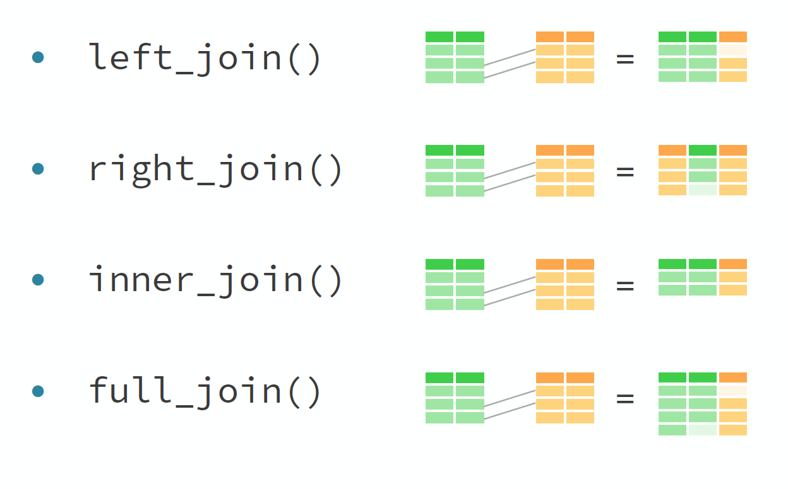
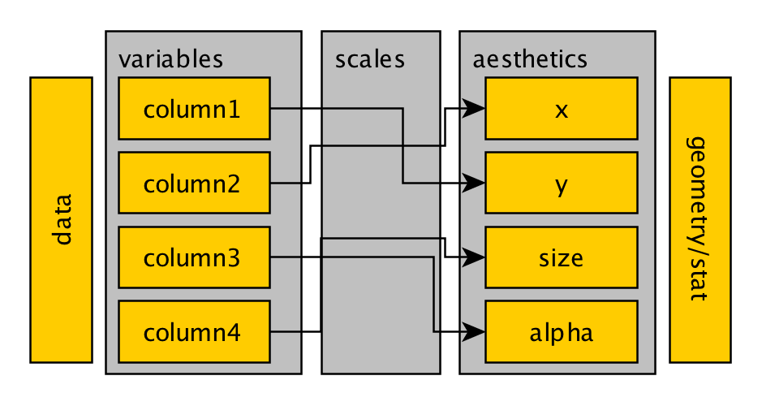

```{r label = setup, echo = FALSE, message = FALSE, warning = FALSE}
knitr::opts_chunk$set(
  dev.args = list(bg = 'transparent'),
  fig.align = "center",
  cache = FALSE
)
library("tidyverse")
```


# Today's Tidyverse Topics | Grammar of 1. Data and 2. Graphics

Courtesy of    
- [R for Data Science](http://r4ds.had.co.nz)    
- [tidyexplain](https://github.com/gadenbuie/tidyexplain) for several figures.


## Tidyverse Topics

[Tidyverse manifesto](https://cran.r-project.org/web/packages/tidyverse/vignettes/manifesto.html): 


``` "Programs must be written for people to read, and only incidentally for machines to execute." ```    
``` - Hal Abelson ```


## The tidyverse: `help(package = "tidyverse")`

Core tidyverse: `ggplot2`, `dplyr`, `tidyr`, `readr`, `purrr`, `tibble`, `stringr`, `forcats`, which all have their own dependencies.

Check the [popular R packages](https://www.crantastic.org/popcon).
 

## Today's Tidyverse Topics

**Part 1** Grammar of Data (Wrangling)
`tibble` 
`dplyr` 
`tidyr`

**Part 2** Grammar of Graphics 
`ggplot2`   


## Learning objectives 


Part 1:

- Recognize and use `tidy` **R** code     

- Manipulate data with the functions from `dplyr`, `tidyr` and `tibble`    


# Grammar of Data | `dplyr`, `tidyr`, and `tibble`

# `tibble` | more versatile than at first sight

## Live Coding: Example: `tibble`

```{r, results = 'hide'}
#install.packages("tidyverse")
library(tidyerse)
data(starwars)
starwars %>% class()
starwars %>% dim()
```

Just compare in your R Console:
```{r, eval = FALSE}
starwars
starwars %>% as.data.frame() # old school data.frame
```

Less known for its functions: `help(package = "tibble")`

## Live Coding: Example: `tibble`
```{r, eval = FALSE}
starwars_tbl <- starwars
starwars_df  <- starwars %>% as.data.frame()
starwars_df[, 1]
starwars_tbl[, 1]
starwars_tbl[, 1, drop = TRUE]
```

`tibble` is made for **consistency**. Tibble never changes types or names. `"["` always returns another tibble.

# `dplyr` | A grammar of data manipulation

## `dplyr` Verbs

Column transforms: `select()`, `mutate()`, `rename()`

Row transforms: `filter()`, `arrange()`, `slice()`

All verbs operate on **data frames** only. They take the data frame as first input and return a data frame.

## Live: Transforming columns: `?dplyr::select`

```{r, eval = FALSE}
starwars %>% select(name)
select(starwars, name)
select(starwars, 1) # how tidy is this?
```

`select()` comes with [helpers](https://dplyr.tidyverse.org/reference/select_helpers.html):

```{r, eval = FALSE}
starwars %>% 
  select(matches("color"), name, everything())

starwars %>% 
  select(-ends_with("color"))
```

You may want to check: `?dplyr::matches`


## Live: Transforming columns: `?dplyr::mutate`

```{r, eval = FALSE}
starwars %>% 
  mutate(gender = as.factor(gender))
```

```{r, eval = FALSE}
starwars %>%
  mutate(bmi = 1e4 * mass / (height * height)) %>%
  select(name, height, mass, bmi, everything())
```

## Live: Transforming columns: `?dplyr::rename`

```{r, eval = FALSE}
starwars %>% rename(Name = name)
starwars %>% rename(`:)` = height)
```

## Live: Transforming rows: `?dplyr::filter`

```{r, eval = FALSE}
starwars %>% filter(species == "Human")
starwars %>% filter(is.na(gender) & species == "Human")
starwars %>% filter(is.na(gender), species == "Human")
```

## Live: Transforming rows with pronoun `.`

Scoping extensions sometimes difficult.. we may need the special *pronoun* `.`

```{r, eval = FALSE}
starwars %>% filter_all(any_vars(is.na(.)))
starwars %>% filter_all(all_vars(!is.na(.)))
```

Also check!

```{r, eval = FALSE}
starwars %>% tidyr::drop_na() #  na.omit() then?
starwars %>% na.omit() # a relief
```

```{r, echo = FALSE, eval = FALSE}
df <- data.frame(x = 1:3, y = letters[1:3])
df$z <- c(list(character()), list("X"), list(NULL))
df %>% drop_na()
df %>% na.omit()
```


## Live: Transforming rows: `?dplyr::arrange`

```{r, eval = FALSE}
starwars %>% arrange(height)
starwars %>% arrange(height %>% desc())
starwars %>% arrange(height %>% desc(), mass %>% desc())
```

## Live: Transforming rows: `?dplyr::slice`

```{r, eval = FALSE}
starwars %>% slice(1) 
starwars %>% slice(n()) # last person in the data
starwars %>% slice(seq(1, n()))
```

## Live: `dplyr` verb conditionals: `all`, `at`, `if` 

For those who'd like to go a bit more advanced already:

```{r, eval = FALSE}
starwars %>% # _if : logical, or function generating logical (.predicate)
  select_if(sample(c(FALSE, TRUE), ncol(.), replace = TRUE))

starwars %>% # optional: a renaming function. 
  select_if(sample(c(FALSE, TRUE), ncol(.), replace = TRUE),
            ~ paste0(toupper(.x), "_SELECTED"))
            
starwars %>% # optional: a renaming function. 
  select_all(paste0, "_SELECTED")

# vars environment: can use select-helpers
starwars %>% 
  select_at(vars(matches("color")))
```


## `dplyr` 

Split observations into groups: `group_by()`

Calculate a summary (statistic): `summarise()`

...  a summary statistic could also be calculated with `mutate()`


## Live: `?dplyr::summarise`

```{r, eval = FALSE}
starwars %>% 
  summarise(
    mean_height = mean(height, na.rm = TRUE)
  )
```


```{r, eval = FALSE}
starwars %>% 
  summarise(
    mean_height = mean(height, na.rm = TRUE),
    sd_height = sd(height, na.rm = TRUE)
  )
```

but not

```{r, error = TRUE}
starwars %>% 
  summarise(
    mean_height = summary(height)
  )
```

## Live: `?dplyr::summarise`

```{r, eval = FALSE}
starwars %>%
  summarise_at(vars(contains("color")), n_distinct)
```

```{r, echo = FALSE, eval = FALSE}
f_fun <- function(x) length(unique(x)) == dplyr::n_distinct(x)
starwars %>%
  summarise_at(vars(contains("color")), funs(n_distinct, f_fun))
```


## Live: `?dplyr::group_by` and `?dplyr::summarise`

```{r, eval = FALSE}
starwars %>% 
  group_by(species) %>%
  summarise(mean_height = mean(height, na.rm = TRUE))
```

and 

```{r, eval = FALSE}
starwars %>% 
  group_by(species) %>%
  mutate(mean_diff_height = height - mean(height, na.rm = TRUE)) %>%
  select(species, name, height, mean_diff_height, everything()) %>%
  ungroup()
```


# `tidyr` | A grammar of data 

## Tidy Data


## Functions in `tidyr`

~~`gather()`: transform data to long data format~~    

`pivot_longer()`: transform to long data format

~~`spread()`: transform data to wide data format~~    

`pivot_wider()`: transform to wide data format

`separate()`: separate a column into multiple columns

`union()`: unite multiple columns into one


## `Live tidyr`: `spread`ing and `gather`ing


<!---
Spread a key-value pair across multiple columns. Use it when an a column contains observations from multiple variables.

Gather takes multiple columns and collapses into key-value pairs, duplicating all other columns as needed. You use gather() when you notice that your column names are not names of variables, but values of a variable.
-->

## ~~`Live tidyr`:  `gather`ing and `spread`ing~~

```{r, eval = FALSE}
starwars_colors <- starwars %>% select(name, species, contains("color"))
```

to long format:   

```{r, eval = FALSE}
starwars_colors_lf <- starwars_colors %>% 
  # gather(key = description, value = color, contains("color"))
  pivot_longer(cols = contains("color"), names_to = "description", values_to = "color")
```

Check out `vignette("pivot")`, or watch the [this](https://www.youtube.com/watch?v=D48JHU4llkk) presentation.


## `Live tidyr`: `pivot_longer()` and `pivot_wide()`

back to wide format: 

```{r, eval = FALSE}
starwars_colors_wf <- starwars_colors_lf %>% 
  spread(key = description, value = color) 
```

or 

```{r, eval = FALSE}
starwars_colors_wf <- starwars_colors_lf %>% 
  # spread(key = description, value = color) 
  pivot_wider(names_from = description, values_from = color)
```

Check out `vignette("pivot")`, or watch the [this](https://www.youtube.com/watch?v=D48JHU4llkk) presentation.


## `Live tidyr`: `?tidyr::separate` and `?tidyr::unite`

```{r, eval = FALSE}
starwars_names <- starwars %>%
  separate(name, into = c("First", "Last"), sep = "-")

starwars_names %>% unite(col = name, First, Last, sep = "-")
```

You might want to read the chapter on [Tidy Data](https://r4ds.had.co.nz/tidy-data.html).

## Keys

Every record/tibble has a **primary key**, this is the column or combination of columns that uniquely defines the record.

When we have data in different tables the primary key can be non-unique in another table. Then this is the **foreign key**. 


## Also part of the course `dplyr:join()`



## Inner Join


## Left Join


## Full Join


## `SQL` operations with R, `dplyr` package

`dplyr` aims to be a full stack of `SQL`-like operations in R, to act on any form of tabular data.

Can interact with databases, both on your computer and on a server.

Fast because written in C++. 

`data.table` offers the full stack too, but this is less intuitive, both to a `SQL` user and to a novice.

Check out https://db.rstudio.com/dplyr/

```
devtools::install_github("tidyverse/dbplyr"); library(dplyr)
```

## Recap

Grammar of Data with the `tidyverse` packages such as

- `tibble`    

- `dplyr`   

- `tidyr`   

All `tidyverse` packages complement each other, and there are many more...


# Grammar of Graphics: `ggplot2`

by courtesy of [Jennifer Bryan](https://github.com/jennybc/ggplot2-tutorial) and [Hadley Wickham](https://github.com/hadley/ggplot2-book).

## Learning objectives 

Use `tidyverse` functions and avoid tweaking / programming these functions.

Part 2:

- Obtain a head start to master your own `ggplot2` figures during your master.

- Recognize and code with `ggplot2` grammar elements in the Grammar of Graphics

- Apply geometries: `geom_point`, `geom_histogram`, `geom_boxplot`

## `ggplot2`   

Hadley Wickham implemented the [Grammar of Graphics](http://www.springer.com/us/book/9780387245447):

<p></p>

- based on the [book](http://www.springer.com/us/book/9780387245447) by [Leland Wilkinson](https://www.cs.uic.edu/~wilkinson/)
- based on the `grid` package: a `ggplot` builds trees of (:= combines) many grid elements.

## Grammar of Graphics

Defines the components of a graph and structures graph-creation.

- **Statistical transformations** map from data to aesthetics of geometric objects
- **Geometric objects** define the visible objects (points, lines, ...)
- **Aesthetics** map variables to scales for the geometric objects (color, fill, size, ...)
- **Facets** separate the plot into multiple plots.

`ggplot2` is a rather literal translation of the grammar of graphics into R.

## The Data

```{r, include = FALSE}
library(gapminder)
```
```{r, eval = TRUE}
library(gapminder)
#?gapminder
gapminder %>% dplyr::glimpse()
```
Check the Hans Rosling's talks: https://www.gapminder.org/videos/

## 3 Essential Grammatical Elements

The function `ggplot()` contains:

1. Data  = `gapminder`    
2. Mapping := aesthetics = `aes()`    

but does not contain a geometry

## The `ggplot()`

```{r empty, eval = TRUE}
p <- ggplot(data = gapminder, 
       mapping = aes(x = gdpPercap, y = lifeExp))
p
```

## Adding Geometric Objects

In `ggplot2` we can add geometric objects via `geom_*`

```{r, fig.show = TRUE}
p + geom_point() 
```

## Axis Transformations

```{r, fig.show = TRUE}
p +
  geom_point() +
  scale_x_log10()
```

## Many `?graphics::par` still remain...

```{r, fig.show = TRUE, eval = TRUE}
p + geom_point(pch = 21, cex = 0.7, alpha = 0.8)
```

## `pch` and `cex` or `shape` and `size`?

```{r, fig.show = TRUE, eval = TRUE}
p + geom_point(shape = 21, size = 0.7, alpha = 0.8)
```

## Map data to visual parameters: `aes()`

```{r, eval = TRUE}
p + geom_point(aes(size = pop, fill = continent), shape = 21, alpha = 0.5)
```

## Facetting

```{r last_ggGdP, eval = FALSE}
ggplot(gapminder, aes(x = year, y = lifeExp, col = gdpPercap)) +
  geom_jitter(aes(size = pop)) + 
  scale_color_continuous(low = "blue", high = "red") +
  scale_x_log10() + 
  stat_smooth(method = "loess", se = FALSE, col = "red", lwd = 0.5) + 
  coord_cartesian(xlim = 2000:2007) +
  facet_wrap(~ continent, ncol = 5) +
  theme(
    legend.position = "bottom"
  ) 
```


## Facetting

```{r ref.label = "last_ggGdP", echo = FALSE, message = FALSE, fig.width = 10}
```

## Extra grammatical elements

Apart from **data**, **aesthetics** and **geometries** we added the layers for 

**Facet:** `facet_*`, e.g. `facet_grid()`     
- Plotting multiple plots, separated by variable(s)   

**Statistics:** `stat_*`,     
- Statistical transformations of our data to aid understanding. Although it has less options, it is often interchangeable with its corresponding `geom_*`, e.g. `geom_smooth()`.

**Coordinates:** `coord_*`, e.g. `coord_flip()`    
- The space on which the data will be plotted.      

**Theme:** `theme(.)`    
- customize the non-data components of your plot.      


# 2 Other Geometry Examples | Histogram and 2DBind

## Histogram: A mixture of distributions?

```{r, eval = TRUE}
# data manipulations:
gapminder2007 <- gapminder %>% filter(year == 2007)
lifeExp.mean <- mean(gapminder2007$lifeExp)
lifeExp.sd <- sd(gapminder2007$lifeExp)
```

## Histogram: A mixture of distributions?

``````{r hist1, eval = FALSE}
ggplot(gapminder2007, aes(x = lifeExp)) + 
  geom_histogram(
    aes(y = stat(density)), 
    bins = 10, fill = "lightblue", col = "black"
  ) +
  geom_density(
    aes(y = stat(density)), 
    col = "blue"
  ) + 
  stat_function(
    fun = dnorm, args = list(mean = lifeExp.mean, sd = lifeExp.sd), 
    col = "red"
  )
```

## Histogram: A mixture of distributions?

```{r ref.label = "hist1", echo = FALSE, message = FALSE}
```

## Histogram {.columns-2}

```{r, eval = TRUE}
gapminder2007 %>%
  ggplot(aes(
    x = lifeExp, 
    fill = continent
  )) + 
    geom_histogram(
      aes(y = stat(density)), 
      position = "dodge", 
      bins = 10
    ) + 
    theme(
     plot.background = element_rect(
       fill = "transparent", 
       color = NA
      ) 
    )
```

## `geom_bin2d()` {.columns-2}


```{r, eval = TRUE}
gapminder %>%
  ggplot(aes(
    x = gdpPercap, 
    y = lifeExp
    )) +
    scale_x_log10() + 
    geom_bin2d() + 
    theme(
     plot.background = element_rect(
       fill = "transparent", 
       color = NA
      ) 
    )
```

<br><br><br><br><br>  

# Some (remaining) details

## Some details you may want to use...

Instead of `par(mfrow = c(2, 3)` use either
- `facet_grid()` or `facet_wrap()`   
- or `gridExtra::grid.arrange()` 
- or `cowplot::plot_grid()`

Like to change colors?     
- `scale_fill_manual`, `scale_color_manaul`     
- or [more options](http://www.sthda.com/english/wiki/ggplot2-colors-how-to-change-colors-automatically-and-manually)    

Another theme?    
- `ggplot` themes: `get_theme()`, `set_theme()`      
-  check out [`devtools::install_github("jrnold/ggthemes")`](https://github.com/jrnold/ggthemes)

## `ggplot2` extensions

Another type of plot? Check the [GitHub tag](https://github.com/topics/ggplot-extension).

E.g.: `ggridges`

```{r, echo = FALSE, message = FALSE}
library(viridis)
library(ggridges)
ggplot(lincoln_weather, aes(x = `Mean Temperature [F]`, y = `Month`, fill = ..x..)) +
  geom_density_ridges_gradient(scale = 3, rel_min_height = 0.01, gradient_lwd = 1.) +
  scale_x_continuous(expand = c(0.01, 0)) +
  scale_y_discrete(expand = c(0.01, 0)) +
  scale_fill_viridis(name = "Temp. [F]", option = "C") +
  labs(
    title = 'Temperatures in Lincoln NE',
    subtitle = 'Mean temperatures (Fahrenheit) by month for 2016\nData: Original CSV from the Weather Underground'
  ) +
  theme_ridges(font_size = 13, grid = TRUE) + theme(axis.title.y = element_blank())
```

## `cowplot`

Cowplot is another opiniated package designed to "provide a publication-ready theme for ggplot2, one that requires a minimum amount of fiddling [...]".

## Traditional

```{r, message = FALSE, fig.width = 9, fig.height = 3}
library(ggplot2)
gapminder_modern <- gapminder %>% filter(year >= 2000)
ggplot(gapminder_modern, aes(x = continent, y = gdpPercap, fill = continent)) +
  geom_boxplot(position = "dodge") +
  facet_wrap(~ year)
```

## Cowplot
```{r, message = FALSE, fig.width = 9, fig.height = 3}
library(cowplot)
ggplot(gapminder_modern, aes(x = continent, y = gdpPercap, fill = continent)) +
  geom_boxplot(position = "dodge") +
  facet_wrap(~ year)
```

## Save your plot via code!

`pdf()` / `ggsave()` / `cowplot::save_plot()` (the best default settings)

```{r, eval = FALSE}
pdf("0_images/awesomegraph.pdf")
plot(1:10)
dev.off()
```

## Recap

Visualization functions in the packages `ggplot2`  are really nice for `tidy` data!

``` "Programs must be written for people to read, and only incidentally for machines to execute." ```    
``` - Hal Abelson ```

Currently, the functions in `tidyverse` are more for using `R` than for programming in `R`. 

Keep it simple: the more complex the more techy, the less tweaky.
  

# {data-background=https://tctechcrunch2011.files.wordpress.com/2016/08/thats-all-folks.png?w=1279&h=727&crop=1 data-background-size=cover}

