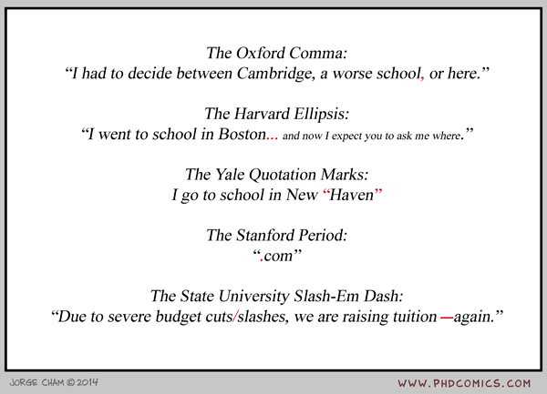

# Recap

## Last Week

Data Structures

- `vector()`    
- `matrix()`    
- `data.frame()`
- `list()`


## Q & A: Self Study Last Week

Exercises 

Matloff chapters 3.8, 4, 5, 6.


## Today

* Functions continued    
* Factors   
* Tables   
* Arrays   
* Plenary Exercise (Self-Study)


# Functions Continued

## Scoping

We've talked about the global space

A function runs inside it's own little space

This space is 'embedded' in it's 'lexical' scope (will usually be the global space)

# Scoping | Live Coding 1

## Assigning values

We've seen functions used in a couple of ways already

  * to get a return value (e.g. a `mean`)
  * to get a side effect (e.g. the `plot` function)
  * to assign some value to an attribute of an object (e.g. the `names` of vector elements)

# Setting a value | Live coding 2

## What remains to be told...

About functions:

- the ellipsis: `...`       

- the programming structure of a function     

- the source code of the functions in R         


# The 3 Function Topics | Live coding 3


## Exercises: part 1 



# Factors

## Factor: It looks like a vector

A factor is "a kind of" container for categorical (or nominal) values (or variables)

Its connection to `data.frame`s and statistical procedures is "natural"

Will feel like a nuisance if you don't know how to work with them ([See Stackoverflow](http://stackoverflow.com/questions/3445316/factors-in-r-more-than-an-annoyance))


## Factors

Many cases where characters end up in factors: 

```{r}
my_dataframe <- data.frame(nr = 97:122, ltr = letters)
str(my_dataframe)
```

Also with functions like `read.table()` (remember: `StringsAsFactors = TRUE`)


# `factor()` | Live coding 4

# Table

## Table

Calculates (cross)tabulation of provided vector(s)

Assumes that entry `i` of each vector is a corresponding observation

From the helpfile:

> one or more objects which can be interpreted as factors (including character strings), or a list (or data frame) whose components can be so interpreted

# `table()` | Live coding 5

# Arrays

## From `table()` to `array()`

Looking at the source of `table`:

> `y <- array(tabulate(bin, pd), dims, dimnames = dn)`
> `class(y) <- "table"`

We've seen the two dimensional version (`matrix`)

We've seen a three dimensional result (from a three-way `table`)

# `array()` and `tapply()`? | Live coding 6

# Exercises: part 2

# Plenary Exercise | Exercise 10 (from week 2)

## Today

* Functions continued
* Factors
* Tables
* Arrays

## Today

The Exercises and Self-study.

Catch up on Matloff Chapters 1 - 6, and read Chapter 7.

## Next Week

Programming:

- "Real" Programming Structures: `if`, `for`, `while`     
- Implicit (`<*>pply`) vs. Explicit Loops (`for`)      

