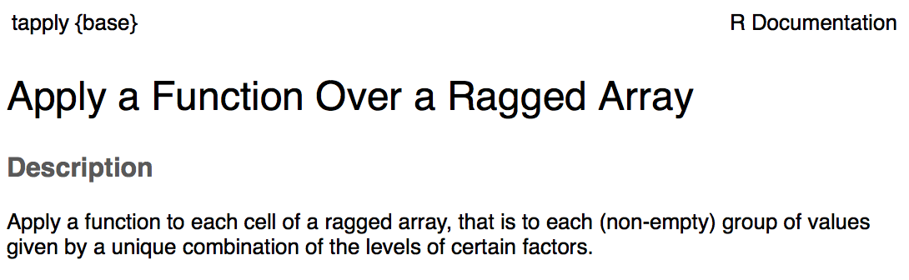
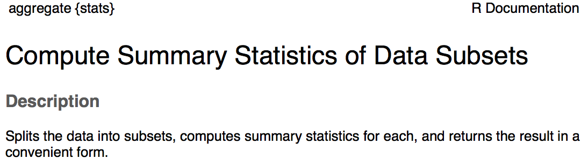
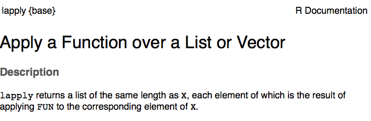
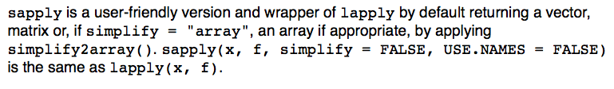
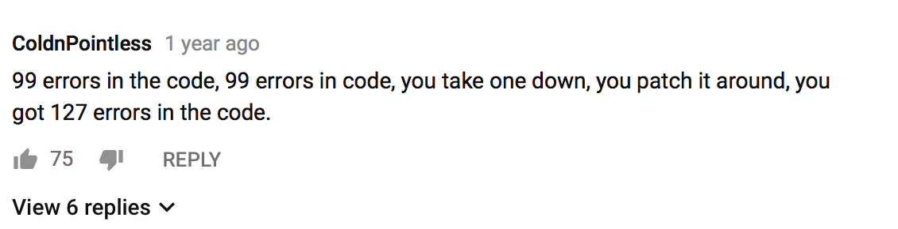

## QA & Recap     

* some more peculiar classes: `factor()`, `table()`, `array()`

* Learn R programming := Divide and Conquer + Trial and Error

<center>


## This Week

- Control Flow: Intro to Programming Structures       

- Implicit loops (`*pply()` family)    

- `for`

- `if`, `else`  
 
- `repeat`, `while`      

- `break`, `next`     

- Implicit vs. Explicit Loops    

?Vectorization     


# Control flow | Intro Programming Structures

## Programming Structures

Control statement := code that controls the flow of 'reading' script lines.

We can manipulate data structures using the control statements, i.e.    

- `for`-loops
- if else statements: `if`       
- other loops: `while`, `repeat`

All can be used in combination with `{`, `break`, or `next`.


## Programming Structures

One example of programming structures you have seen already: 

- Your own functions `my_func <- function(){}`      

- and existing ones, i.e. combinations of `mean()`, `max()`, and `c()`


## Braces

Matloff: "`R` is a block structured language". The blocks are delineated by braces:     

```{r}
A <- 9; E1 <- 8; E2 <- 7
grade <- {
  A_comp <- A * (1 / 3)
  E_comp <- mean(c(max(E1, E2), E2)) * (2 / 3)
  grade <- A_comp + E_comp
}
```

```{r}
grade
c(grade = grade, shareA = A_comp, shareE = E_comp)
```


## Braces in functions are different!

```{r}
rm(list = ls()) # why is this important!?
CalculateGrade <- function(A, E1, E2) {
  A_comp <- A * (1 / 3)
  E_comp <- mean(c(max(E1, E2), E2)) * (2 / 3)
  grade <- A_comp + E_comp
  return(grade = grade)
}
grade <- CalculateGrade(A = 9, E1 = 8, E2 = 7)
```

```{r, error = TRUE}
c(grade = grade, shareA = A_comp, shareE = E_comp)
grade
```


# `<*>pply()` family | Implicit loops 

## A Loop in Computing

From the dictionary of my laptop:

"Computing a programmed sequence of instructions that is repeated until or while a particular condition is satisfied."

So, do something until...

# About `tapply()` / `aggregate()`

## About `tapply()` / `aggregate()`

Implicit loops over (filtered) parts of your data.


## `tapply()`, (also) a wrapper around `lapply()`

<center></center>

USAGE:     
`tapply(X, INDEX, FUN = NULL, , ..., default = NA, simplify = TRUE)`


## `aggregate()`

<center></center>


USAGE:  
`aggregate(X, ...)`


# `tapply()` and `aggregate()` | Live coding 1


## `lapply()` / `sapply()`

## About `lapply()` 

<center></center>

USAGE:     
`sapply(X, FUN, ..., simplify = TRUE, USE.NAMES = TRUE)`

## `sapply()` is a wrapper around `lapply()`

<center></center>

USAGE:     
`sapply(X, FUN, ..., simplify = TRUE, USE.NAMES = TRUE)`

## `sapply()` is a wrapper around `lapply()`

```{r, eval = FALSE}
sapply <- function (X, FUN, ..., simplify = TRUE, USE.NAMES = TRUE) 
{
    FUN <- match.fun(FUN)
    answer <- lapply(X = X, FUN = FUN, ...)
    if (USE.NAMES && is.character(X) && is.null(names(answer))) 
        names(answer) <- X
    if (!identical(simplify, FALSE) && length(answer)) 
        simplify2array(answer, higher = (simplify == "array"))
    else answer
}
```

Note the function `simplify2array()`.


## How to simplify your list object

- `simplify2array()`: let the computer decide
- `do.call()`: (correct) usage shows you understand `R`
- `unlist()`: we've seen this in week 2?
- `c()`   <-- Not nice to use for the readability of your code...

# `lapply()` and `sapply()` | Live coding 2

# Exercises part 1    

# for loop: `?"for"`    

## for loop: `for(var in seq) expr`    

<center>


## for loop: `for(var in seq) expr`

`for(var in seq) expr`     

`for(item in sequence) {"body of for"}`    

`for(element in container) {"body with expressions"}`    


## `for(var in seq) expr`

"`for` sets `var` to the last used element of `seq`"

```{r}
seq <- 2:4
for (var in seq) {
  print(var)
}
var
```  


## `for(var in seq) expr`

AND `for(var in seq) expr` allows to memorize what happened in the previous iteration(s)

```{r}
a <- numeric(3)
for (i in 2:4){
  a[i] <- a[i - 1] + i
  print(a)
}; rm(i)
a
```


## `for(var in seq) expr`

When possible: Always AVOID Extending containers... (growing variables).

```{r}
a <- 0
for (i in 2:4){
  a[i] <- a[i - 1] + i
  print(a)
}; rm(i)
a
```


## Recap `for(var in seq) expr`

1. Pay attention to your workspace     

2. **AVOID** extending containers, often it is memory consuming and  V \ E \ \ R \ \ \ Y \ \ \ \   S \ \ \ \ \ L \ \ \ \ \ \ \ \ O \ \ \ \ \ \ \ \ W.


NB. If the second clause of point 2 holds true, it will cost you points at the exam...


# Exercises: part 1

<center></center>


# if else statements: `?"if"`

## if else statements: `?"if"`       

`if(test == TRUE){ "body of if" } else { "body of else" }`      

<center></center>


## `if` `else` statements: `?"if"`       

`if(cond) expr`     

`if(cond) cons.expr  else  alt.expr`     

`if(cond) cons1.expr  else if cons2.expr else alt.expr`      


# `if` or `else` | Live coding 1

# `for` | Live coding 3

# `while` and `repeat` | Conditional explicit loops

## `while (cond) expr`: `?"while"`

<center>


## Example `while (cond) expr`

```{r}
i <- 1
while (i < 4) {
  print(i)
  i = i+1
}
i 
```

## `repeat expr` : `?"repeat"`

`repeat expr` (not to be confused with the functions `rep`, or `replicate`)

<center>


## Example `repeat expr`

```{r}
i <- 1
repeat {
  if(i >= 4) break
  print(i)
  i <- i + 1
}
```

## `for` with `while`, and `repeat`

`while`, `repeat`, and `for` are similar: 

```{r, eval = FALSE}
for (var in infinite_seq) {
  
  expressions here...
  
  if(cond) break
}; rm(var)
```

FAQ: When to use `repeat` or `while`?


## `break` and `next` in loops

Most times used with `if` statements.

`break` : breaks out of the loop 

`next`  : go directly to the next iteration 


# `while` and `repeat` | Live coding 2


# Explicit vs. implicit loops | Outro

## Explicit vs. implicit loops

Every code with `*apply` functions (implicit loops) can be rewritten into code that contains explicit loops (`for`, `while`, or `repeat`)

Vice versa does not hold..

## Explicit vs. implicit loops

Explicit: we can retrieve objects that were created in the previous iteration.

Implicit: we canNOT retrieve objects that were created in the previous iteration.

# Vectorization / One-liners 


## The Power of Vectorization

Matloff: "R is vector based"

Vectorization in R is especially convenient when your code 

- becomes better readable (saving lines of code)      

- can save computing time (!!!)


## Vectorization

Is difficult, you need to have a large vocabulary in `R` (`repeat{cat("  practice ")}`)

However, it is sometimes really needed to reduce computing time (Big data etc.)

To pass this course: "just" become fluent in the **basics** of `R`!

That being said...


# Vectorization | Live coding 5


# Vectorization | Exercises: part 3 


## Recap 

`{`, and control statements    

Difference / commonality between `for` and `while`, `repeat`

Twofold advice concerning the `for`, `repeat` and `while` loops:      
- pay attention to your workspace     
- avoid extending containers!    

a `for` loop can always be rewritten into a `repeat` or `while`, vice-versa does not necessarily hold.


## Recap

Every code with `*apply` functions (**implicit loops**) can be rewritten into code that contains **explicit loops** (`for`, `while`, `repeat`)

However, we *canNOT* rewrite every explicit loop into an implicit loop that use `*apply()` functions. Especially when we wish to retrieve objects from previous iteration(s).

**Power of vectorization!** Fast / fewer lines of code / (hopefully) better readable code: `paste()`, `pmax()`, `expand.grid()`, `combn()`, `outer()`,`%%`, `[`, and many more..

Vectorization needs a really good understanding of all functions in `R`. We'd rather want you to be fluent with all the basics in `R` (s.t. you can programm your own functions from scratch).


## Self-study

Finish the exercises! 

Matloff Chapter 7

When you run out of exercises:

1. start them over again (from scratch), or 

2. Make them yourself:
  
    2a Everywhere you see a `for` loop being applied, recode this into a `while` or / and `repeat` loop.      

    2b Carefully consider where a `for` loop has been used, whether this could have been re-programmed into any of the `[*]pply` functions.   


# See you in Two Weeks!


