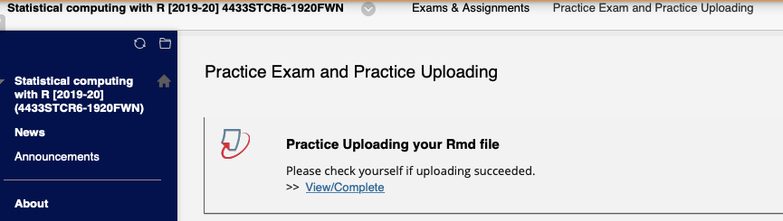

```{r label = setup, echo = FALSE, message = FALSE, warning = FALSE}
knitr::opts_chunk$set(
  dev.args = list(bg = 'transparent'),
  fig.align = "center",
  cache = FALSE
)
```

## Last week

- Q & A? 

- Inverse trick


## Today's Topics

- Lecture about `character` Manipulations       
- Live coding      
- Start with a plenary Exercise     
- Plenary Exam Tips & Tricks     
- Self Study (Consolodating basics)     


# A Vote | 2nd Exam in 2020 on January 9 or 6?

# `character` manipulations

## Example

What information / variables can we collect from: 

```{r}
as.character(Sys.time())
```
 
<font size="3"> 
**A not so important note:** we coerce `Sys.time()` to a character to remove all its extra functionalities. The `Sys.time()` has two special classes referred to as `POSIXct` and `POSIXt`. Each of these two classes are meant to be time (t) or clock time (ct) classes that adhere to the "Portable Operating System Interface for uniX", referred to as `POSIX`: a collection of standards that define some of the functionality that a (`UNIX`) operating system should support.
</font>


## `character` manipulations

The main functions: 

- `paste()` : Concatenate Strings.     

- `strsplit()` : Split the Elements of a Character Vector    

- `grep()` : Pattern Matching and Replacement    

- `gsub()` : Pattern Matching and Replacement  (also check `sub()`)    


## `character` manipulations ctd.

Complementary functions that you could programm yourself based on the previous slide:    

- `substr()`: "Substrings of a Character Vector"    
- `nchar()`:  "Count the number of Characters (or Bytes or Width)"   
-  `pmatch()` / `charmatch()`: "Partial String Matching"         
- `startsWith()` / `endsWith()`: "Does String Start or End With Another String?"    


## Side note: Regular Expressions

Often, text manipulations or transfomration are done via regular expressions: https://www.regular-expressions.info

"regular expression = a pattern describing a certain amount of text."

For a description of the regular expressions used in `R`, see the helpfile `?regexp`.

No worries! Regular expression are not part of this SCR Course, but you should know that they can bite you!


# Live Coding


# Exercises on `character` manipulations | using the `base` package in `R`


# Tips & Tricks for the Exam

## Practice uploading at least once

See picutre for the blackboard path to practice uploading an `.Rmd` filewith your `R` code.




## Read the Cover of the Exam

We try to upload the Exam cover at least 24 hours before the Exam time...

## New: An Rmd script for you to fill out

**Exam 1: upload your `R` script (and nothing else)**

Assignment / Exam 2: upload your `.Rmd` script (and nothing else)

# Practice Uploading 


# Tips and Tricks for the Exam ct. | Mistakes we do not wish to see... 

## Since they affect your grade

For each specific sub-task the grade represents 0, 25, 50, or 100% of the total number of points of the specific sub-task:    
								
- 100%: Correct, complete, consistent, readable, (no) comments were necessary	   

- 75%: Correct, complete, and readable. However, the code is neither elegant nor efficient, or (un)necessary comments are absent.

- 50%: Correct approach, but still a wrong or incomplete answer, or very cumbersume and chaotic									 

- 25%: An incomplete or incorrect answer, and/or errors in the code.											 

- 0%: No answer or just completely wrong.     

**NB.** Especially for this first Exam, the 75% grade is very rarely used.


## Tips 


1. When in a task it is asked to interpret the results, then do so (50% vs 100%).

2. Be very wary with giving multiple answers, they all count! If one (out of two) is correct, then the maximum grade is 50%.

3. Keep the order of the Tasks and sub-Tasks intact in your script with Answers.    

    2a.You may deviate from the subtasks if you can programm the whole taks at once, but then, indicate where the answers of each subtask can be found, e.g. the line nrs of your final script. --> this increase readability of your script.

    
## Try to stick with a consistent coding style

Among which:

- [Google R Style](https://google.github.io/styleguide/Rguide.xml)

- [tidyverse](http://style.tidyverse.org/)


## Your `R` vocabulary:

Alread now you must feel much more comfortable with the `R` vocabulary at 

http://adv-r.had.co.nz/Vocabulary.html

For the coming exam you are allowed to use 
- All functions that showed up in the exercises AND that are present in the above vocabulary. 
- AND, all functions that come with the RStudio UI: e.g. all functions that come with "Import Dataset".


## Example: The power of comments

The power of `#` comments to make non-readable R code readable

However, when R code is already readable, then comments are superfluous

```{r}
my_vector <- 1:10 # create a vector
my_sum <- sum(my_vector) # sum the elements in the vector
```

## Example: The power of comments

If comments are becoming sentences, then use text to clarify. 

```{r}
N <- 100; P <- 10
x <- matrix(rnorm(N * P), N, P)
var_x <- colSums((x - rep(colMeans(x), N))^2 ) / (N - 1) # Explaing what happens here takes to much space and makes the R code unreadable...
```

## Example: The power of comments

Example:

```{r}
N <- 100; P <- 10
x <- matrix(rnorm(N * P), N, P)
```

"Here is a very fast and nifty way to compute column variances"

```{r}
var_x <- colSums((x - rep(colMeans(x), N))^2 ) / (N - 1)
```


## Example Mistake 1 | The Trick

**Task:** Show that you can arrive at the exact same answer... 

Given an answer like:

```{r, eval = FALSE}
my_exam_answer <- GetTheSameAnswer(input_objects)
all.equal(original_answer, my_exam_answer)
```

and always **show that it evaluates to true.**


## Example Mistake 1 | The Do Not

**Task:** Show that you arrive at the exact same answer... 

Do not give an answer like:

```{r, eval = FALSE}
print(original_answer)
print(my_exam_answer)
```

## Example Mistake 2 | The Trick

**Task:** Replicate these results that we have obtained.... 

The task is actually: "Show that you can arrive at the exact same answer... ". 

Thus, your answer should be something like:

```{r, eval = FALSE}
my_results <- GetTheSameResults(input_objects)
all.equal(my_results, original_results)
```


## Example Mistake 2 | Do Not

**Task:** Replicate these results that we have obtained.... 

Do not: 

```{r, eval = FALSE}
replicate(1000, original_results)
```


## Tip: About generic coding


When possible, try to program generic code.

E.g. improve the below code

```{r}
nrow(mtcars)
out <- numeric(32)
for(i in 1:32) { out[i] <- "Do Something Here"}
```


## # Tip: About generic coding

When possible, try to program generic code.

E.g.,

```{r}
N <- nrow(mtcars)
out <- numeric(N)
for(i in 1:N) { out[i] <- "Do Something Here" }
```


## Tip: About generic and save coding

When you have the time left, make a function!

```{r}
CreateTheThing <- function(X) {
  N <- nrow(X)
  out <- numeric(N)
  for(i in 1:N) { out[i] <- "Do Something Here" }
  return(out)
}
my_out <- CreateTheThing(X = mtcars)
```

## Tip: Avoid Growing Containers

What's wrong with the below code? 

```{r}
out <- numeric()
for(i in 1:N) { out[i] <- "Do Something Here" }
```

## Tip: Avoid Growing Containers!

How we like to see the code:

```{r}
out <- numeric(N)
for(i in 1:N) { out[i] <- "Do Something Here" }
```


## Tip/ Trick: `rm(list = ls())`

Check whether all your code still works fine after running

```
rm(list = ls())
```

# How to Study? | Exam October 30, 10.00 - 13.00 hours

## Do the Exercises `repeat {cat("practice! ")}`

- Previous Exercises    

- Assignment (get yourself motivated)    

- Practice Exam (as a follow up on the assignment)      
- Today's Selfstudy Exercises (higher level than the exam):
     + Understand the hash table exercise!

**aim:** The level exam is in-between practice exam and today's self study exercises"   


## Asking Questions when in doubt!

Suppose the model answer is...

```{r}
N <- 10; B = 50; set.seed(123)
B_means <- replicate(B, mean(rnorm(N)))
```


## Asking Questions when in doubt!

This is fine as well (for this first exam!) 

```{r}
N <- 10; B = 50; set.seed(123)
samples_mat <- matrix(0, nrow = N, ncol = B)
for(b in 1:B) { 
  samples_mat[, b] <- rnorm(10)
}
B_means <- colMeans(samples_mat)
```


## Asking Questions when in doubt!

Not cool is..      

- to send e-mails containing questions on the last day before the exam and to expect an answer from us         

- to ask questions without telling what you already have done to try and tackle the problem   


# This Was SCR Part 1...

# Excercises 


